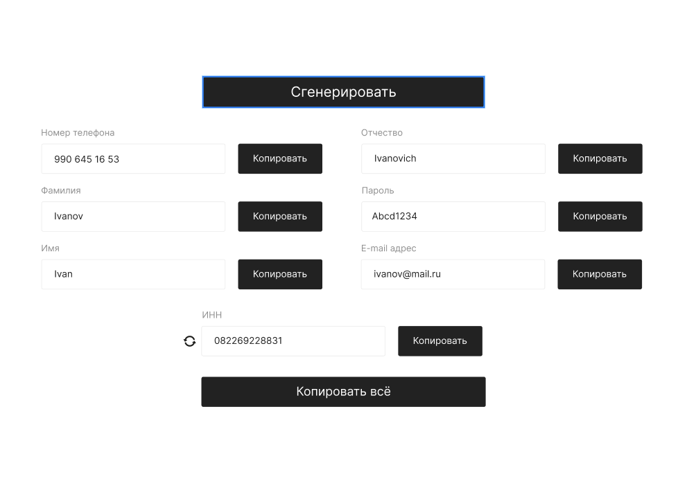

# Страница генерации случайных данных для тестирования приложения.



## Общее:

Необходимо создать адаптивную страницу генерации случайных данных согласно [макету](https://www.figma.com/file/QlP07FtPKoJJ7DUUik6XOh/Untitled?type=design&node-id=0-1&mode=design&t=E0oktPL0vM7B2KWQ-0) в Figma.

## Форма генерации:

Кнопка "Сгенерировать" генерирует случайные данные во всех полях.
При повторном нажатии на кнопку "Сгенерировать", данные генерируются повторно. 

Поле "Номер телефона" генерирует номер телефона в международном формате без кода страны.

Поля "Фамилия", "Имя", "Отчество" генерируют данные согласно данным находящихся в приложенных файлах переведённых в их транслитерацию.
По умолчанию ФИО генерируются для мужчины, но есть возможность переключения для генерации ФИО для женщины.

Поле "E-mail адрес" генерирует адрес электронной почты согласно регулярному выражению ```^[a-zA-Z0-9_.+-]+@[a-zA-Z0-9-]+\.[a-zA-Z0-9-.]+$```.

Поле "ИНН" сгенерирует идентификационный номер налогоплательщика согласно регулярному выражению ```/^[\w]{1}[\w-\.]*@[\w-]+\.[a-z]{2,4}$/i```.
Кнопка слева от поля ИНН, генерирует ИНН заново, не меняя остальные данные.


## Копирование:

Каждое поле копируется отдельно в буфер обмена по нажатии на кнопку "Копировать".

Кнопка "Копировать всё" копирует данные из каждого поля, данные по каждому полю копируются с новой строки в буфер обмена.
